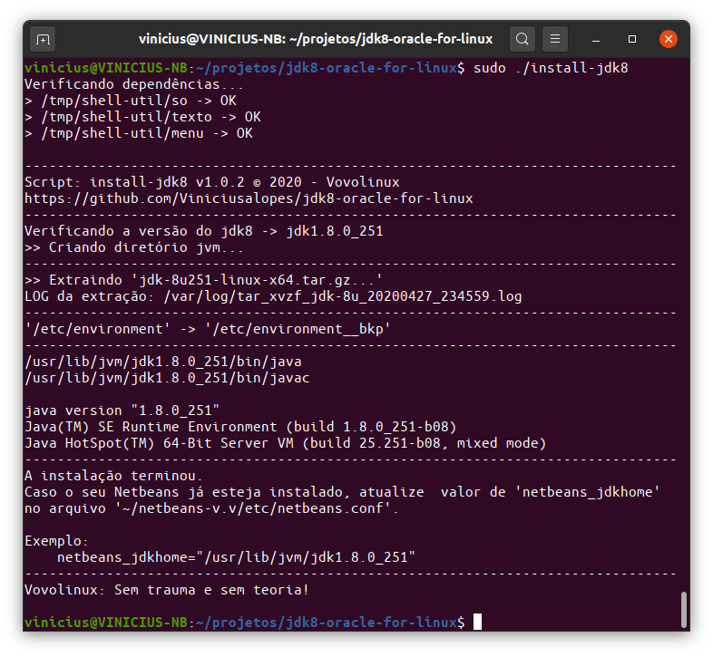

# Install Oracle JDK 8 on Linux
## Instalação automáGica do Oracle JDK 8 no Linux/Ubuntu 


```
#-----------HEADER-------------------------------------------------------------|
# AUTOR             : Vovolinux <suporte@vovolinux.com.br>
# HOMEPAGE          : https://vovolinux.com.br 
# DATA DE CRIAÇÃO   : 15/12/2019 às 21:07 
# PROGRAMA          : install-jdk8
# VERSÃO            : 1.0.2
# LICENÇA           : MIT - © 2020 - Vovolinux
# PEQUENA DESCRIÇÃO : Instalação do Java SE Development Kit 8 para GNU/Linux
# 
# CHANGELOG :
# 2020-04-26 - v1.0.2 - Vovolinux:
#   - Detecção de arquivos 'jdk-8u*-linux-*.tar.gz' no diretório do script.
#   - Detecção automáGica da versão do JDK a ser instalado.
#   - Incluída a opção de continuar mesmo que este script ainda não tenha
#     sido testado com a distribuição atual.
#   - Modularização de funções com scripts do projeto 'shell-util'
#     <https://github.com/Viniciusalopes/shell-util>
#   - Incluída a sessão --- DEPENDÊNCIAS ---
#
# 2019-12-15 - v1.0.1 - Vovolinux:
#   - Melhoria de comentários e aproveitamento de variáveis.
#   - Substituição de 'echo' por 'printf' e 'cat << EOF'.
#
#------------------------------------------------------------------------------|
```

# Instruções

- Fazer o download do arquivo __jdk-8u*-linux-*.tar.gz__ no site oficial -> [Java SE Development Kit 8 Downloads](https://www.oracle.com/java/technologies/javase/javase-jdk8-downloads.html)


- Salvar o script [install-jdk8](install-jdk8) no mesmo diretório de download do arquivo __jdk-8u*-linux-*.tar.gz__ 

- __Acessar o diretório dos downloads pelo terminal e executar o comando:__
```
sudo bash install-jdk8
```

---

## Saída padrão




__FONTE:__ [Install Oracle JDK 8 on Linux](https://www.javahelps.com/2015/03/install-oracle-jdk-in-ubuntu.html)

## LOG de instalação
[tar_xvzf_jdk-8.log](tar_xvzf_jdk-8.log)
