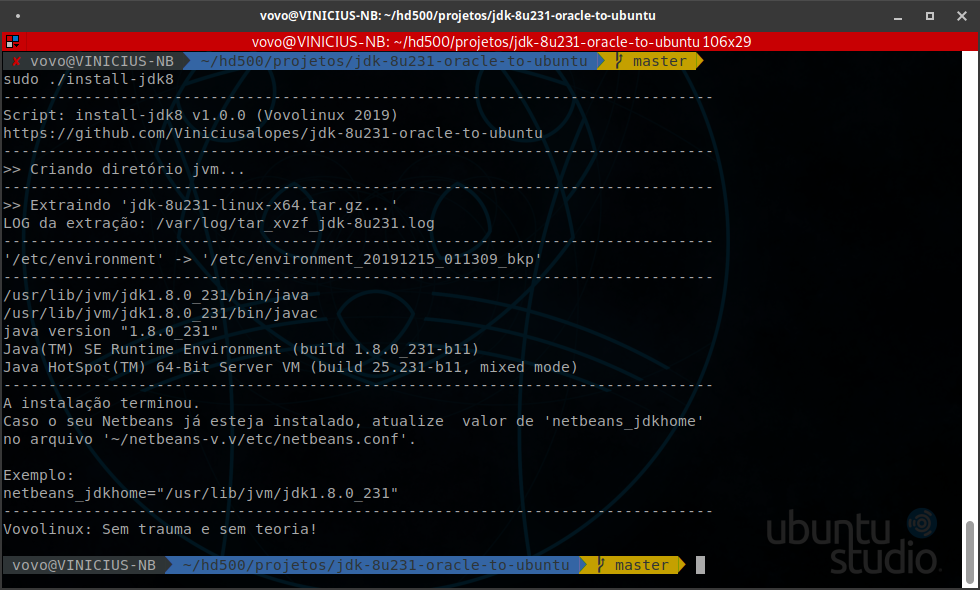

# Install Oracle JDK 8 on Linux
## Instalação automáGica do Oracle JDK 8 no Linux/Ubuntu 19.10


```
AUTOR             : Vovolinux <suporte@vovolinux.com.br>
HOMEPAGE          : https://vovolinux.com.br 
DATA-DE-CRIAÇÃO   : 15/12/2019 às 00:07 
PROGRAMA          : install-jdk8
VERSÃO            : 1.0.0
LICENÇA           : MIT
PEQUENA-DESCRIÇÃO : Instalação do Java SE Development Kit 8 para Ubuntu 19.10

TESTADO COM:
NAME="Ubuntu"
VERSION="19.10 (Eoan Ermine)"
ID=ubuntu
ID_LIKE=debian
PRETTY_NAME="Ubuntu 19.10"
VERSION_ID="19.10"
HOME_URL="https://www.ubuntu.com/"
SUPPORT_URL="https://help.ubuntu.com/"
BUG_REPORT_URL="https://bugs.launchpad.net/ubuntu/"
PRIVACY_POLICY_URL="https://www.ubuntu.com/legal/terms-and-policies/privacy-policy"
VERSION_CODENAME=eoan
UBUNTU_CODENAME=eoan

Linux VINICIUS-NB 5.3.0-24-lowlatency #26-Ubuntu SMP PREEMPT
Thu Nov 14 02:16:52 UTC 2019 x86_64 x86_64 x86_64 GNU/Linux
```

# Instruções

- Fazer o download do arquivo __jdk-8u231-linux-x64.tar.gz__ no site oficial -> [Java SE Development Kit 8 Downloads](https://www.oracle.com/technetwork/java/javase/downloads/jdk8-downloads-2133151.html)


- Salvar o script [install-jdk8](install-jdk8) no mesmo diretório de download do arquivo __jdk-8u231-linux-x64.tar.gz__ 

- __Conceder permissão de execução para o script__
```
chmod +x install-jdk8
```

- __Executar o script__
```
sudo ./install-jdk8
```

---

## Saída padrão




__FONTE:__ [Install Oracle JDK 8 on Linux](https://www.javahelps.com/2015/03/install-oracle-jdk-in-ubuntu.html)

## LOG de instalação
[tar_xvzf_jdk-8u231.log](tar_xvzf_jdk-8u231.log)
